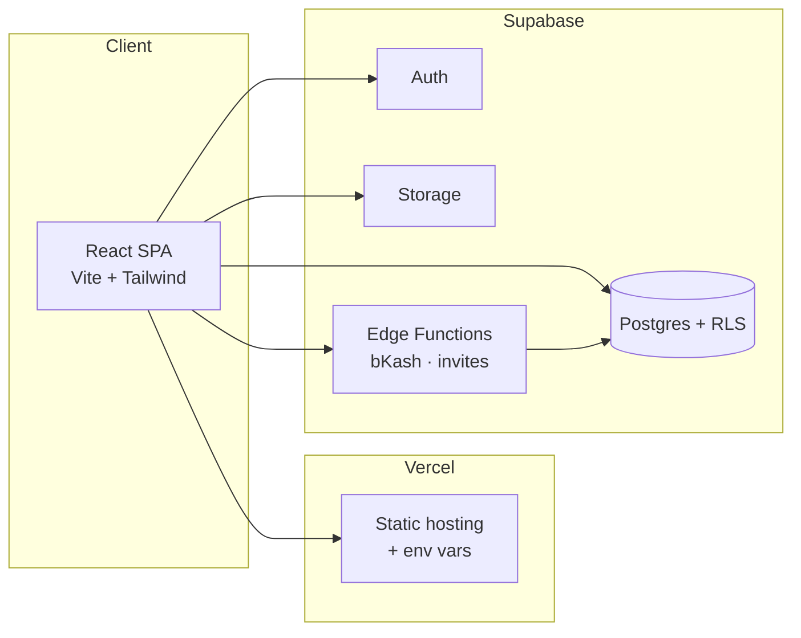

<div align="center">

# Shoukhin · শৌখিন

### Premium Bangladeshi lifestyle ecommerce — built end-to-end, deployed to production

[](https://soukhin.vercel.app)
[](https://react.dev)
[](https://www.typescriptlang.org)
[](https://supabase.com)
[](https://vercel.com)

**[→ Open the live store](https://soukhin.vercel.app)** · **[Track an order](https://soukhin.vercel.app/track-order)** · **[About the brand](https://soukhin.vercel.app/about)**

*Wearables · Homemade pitha · Jewelry · Gift hampers — bilingual EN/BN, mobile-first, production-hardened.*

</div>

---

## At a glance

| | |
|---|---|
| **What it is** | Full-stack ecommerce for a real Bangladeshi lifestyle brand — storefront + role-based admin dashboard |
| **Stack** | React 18 · TypeScript · Vite · Tailwind · Supabase (Postgres, Auth, Storage, Edge Functions) · Vercel |
| **Highlights** | Server-validated checkout · 5 staff roles · bKash integration · analytics dashboard · rate limiting & RLS |
| **Built by** | [Ridhwan](mailto:ridhwankhan03@gmail.com) — full-stack developer |

---

## Screenshots

> **📸 Add your images:** Save PNGs to [`docs/screenshots/`](./docs/screenshots/) using the filenames below.  
> Full capture guide: **[docs/screenshots/README.md](./docs/screenshots/README.md)**

### Storefront

<p align="center">
  
</p>

<p align="center">
  
  
</p>

<p align="center">
  
  
</p>

### Admin dashboard

<p align="center">
  
</p>

<p align="center">
  
  
</p>

---

## Why this project stands out

This is not a tutorial clone — it is a **production deployment** solving real ecommerce problems for the Bangladesh market.

### Customer experience
- **Bilingual UI** — English + Bengali labels across navigation, categories, and content
- **Rich catalog** — nested categories, search, filters, featured & new-arrival sections
- **Account system** — email verification, wishlist, order history, profile management
- **Checkout** — cart persistence, server-side price validation, COD + manual bKash + tokenized bKash (edge function)
- **Trust & support** — order tracking, contact form with spam protection, WhatsApp FAB, policies & FAQ
- **Polish** — Framer Motion animations, light/dark theme, responsive layout, compressed image uploads

### Admin & operations
- **Role-based access** — Owner, Admin, Moderator, Order Manager, Inventory Manager
- **Staff onboarding** — invite flow via Supabase Edge Function + email
- **Products** — CRUD with Supabase Storage, low-stock alerts
- **Orders** — status workflow, analytics, category revenue charts (Recharts)
- **Security** — session idle timeout, permission checks on every admin action, audit-friendly design

### Engineering depth
- **9 SQL migrations** — schema, RLS policies, seed data, production hardening
- **Edge functions** — `invite-staff`, `bkash-payment`
- **Security** — rate limits on auth/contact/search/track-order; `create_order_secure` RPC; no service keys in frontend
- **DevOps** — one-click SQL setup script, env template for Vercel, load-test script

---

## Architecture



---

## Feature matrix

| Area | Capabilities |
|------|----------------|
| **Storefront** | Catalog, search, cart, wishlist, checkout, track order, contact |
| **Payments** | Cash on delivery, manual bKash TX ID, tokenized bKash API |
| **Auth** | Customer signup + email verify; unified `/auth` for staff & shoppers |
| **Admin** | Dashboard analytics, products, orders, users, announcements, settings |
| **i18n** | Bengali + English across nav, categories, hero, footer |
| **Theme** | Light / dark mode with brand tokens |

---

## Tech stack

| Layer | Tools |
|-------|--------|
| **Frontend** | React 18, TypeScript, Vite, React Router, Tailwind CSS, Framer Motion, Lucide |
| **Data viz** | Recharts (admin revenue & category breakdown) |
| **Backend** | Supabase — PostgreSQL, Row Level Security, Auth, Storage, Edge Functions |
| **Hosting** | Vercel (frontend), Supabase cloud (backend) |
| **Payments** | bKash tokenized checkout (sandbox + production-ready edge function) |
| **Quality** | ESLint, TypeScript strict check, client-side image compression |

---

## Project structure

```
src/
├── admin/              # Dashboard — products, orders, users, analytics
├── components/         # UI, layout, cart, auth guards
├── config/             # Brand tokens, roles, delivery, payment
├── context/            # Auth, cart, wishlist, theme
├── lib/                # Supabase services (orders, products, staff, …)
├── pages/customer/     # Storefront
└── pages/info/         # About, contact, policies

supabase/
├── migrations/         # Versioned schema (9 files)
├── functions/          # invite-staff, bkash-payment
└── ONE_CLICK_DATABASE_SETUP.sql
```

---

## Security (production-minded)

- Admin routes gated by role + server-side permission checks
- Checkout prices re-validated in Postgres (`create_order_secure`) — client cannot tamper with totals
- Rate limiting on contact, search, track-order, and auth endpoints
- Product image uploads restricted to staff with `manage-products`
- bKash callback verifies order ownership and amount
- Secrets live in Vercel / Supabase — never committed to Git

---

## Run locally

```bash
git clone https://github.com/ridhwankhan/soukhin.git
cd soukhin
npm install
cp env.import.template .env   # add Supabase URL + anon key
npm run dev                   # http://localhost:5173
```

```bash
npm run build      # production build
npm run typecheck  # TypeScript
npm run load-test  # optional API stress test
```

**Deploy from scratch:** see **[DEPLOY_FROM_ZERO.md](./DEPLOY_FROM_ZERO.md)** — Supabase + Vercel step-by-step.

---

## Developer

**Ridhwan** — full-stack developer  
📧 [ridhwankhan03@gmail.com](mailto:ridhwankhan03@gmail.com)  
🔗 [Live demo](https://soukhin.vercel.app) · [GitHub](https://github.com/ridhwankhan/soukhin)

*Store contact (brand): [shoukhin.lifestyle.bd@gmail.com](mailto:shoukhin.lifestyle.bd@gmail.com) · WhatsApp via site*

---

<p align="center">
  <sub>MIT License · Built for the Bangladeshi ecommerce community</sub>
</p>
